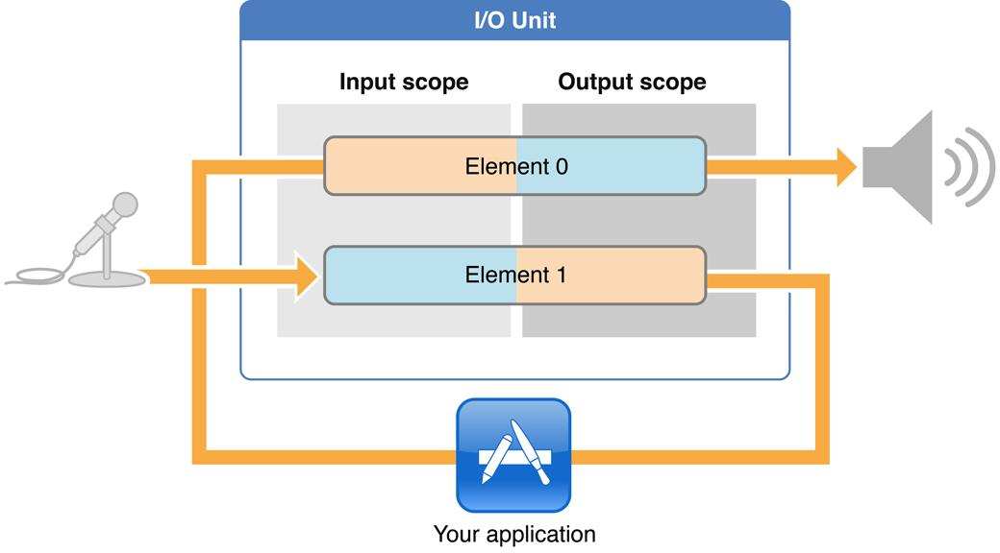
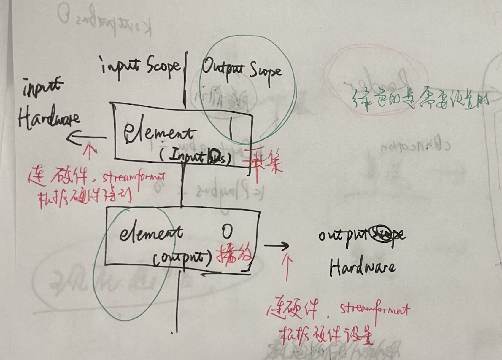
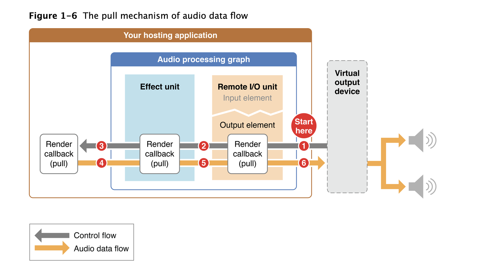

## 官方文档
[The Audio Unit](https://developer.apple.com/library/archive/documentation/MusicAudio/Conceptual/AudioUnitProgrammingGuide/TheAudioUnit/TheAudioUnit.html#//apple_ref/doc/uid/TP40003278-CH12-SW1)
[IO audio unit](https://developer.apple.com/library/archive/documentation/MusicAudio/Conceptual/AudioUnitHostingGuide_iOS/UsingSpecificAudioUnits/UsingSpecificAudioUnits.html#//apple_ref/doc/uid/TP40009492-CH17-SW1)

## 
[iOS Play audio data through Audio Unit](https://www.programmersought.com/article/38823768580/)

好奇怪的文章，图片都是中文的
地下链接了一些文章

## 简书
[简书Audio Unit详解](https://www.jianshu.com/p/8ce865c9bbac)

> audio unit是一个插件
> audio unit可以有多个
> audio unit iOS根据功能提供了七种audio unit，分为四类: effect, mixing, i/o, format conversion
> I/O输出unit，直接连接输出硬件。
> VPIO和RemoteIO是属于IO audio unit提供的一种功能

### 1. 七种四类audio unit
3.1 Effect Unit
iOS4提供了一个effect unit，即iPod Equalizer，与内置iPod应用程序使用的均衡器相同。要查看该audio unit的iPod应用程序用户界面，请转至Setting> iPod> EQ。 使用此audio unit时，您必须提供自己的UI。 该audio unit提供一组预设均衡曲线，如低音增强器，流行音乐和口语

3.2 Mixer Units
iOS提供两个mixer units。3D Mixer unit是OpenAL构建的基础。在大多数情况下，如果需要3D Mixer unit的功能，最佳选择是使用OpenAL，它提供更适合游戏应用的更高级API。

Multichannel Mixer unit可以为任意数量的单声道或立体声流提供混音，并带有立体声输出。你可以打开或关闭每个输入，设置其输入增益，并设置其立体声平移位置。

3.3 I/O Units
iOS提供三个I/O unit。Remote I/O是最常用的。它连接输入和输出音频硬件，并为你提供对各个传入和传出音频样品值的低延迟访问。它提供硬件音频格式和应用程序音频格式之间的格式转换，通过Format Converter unit进行格式转换。

Voice-Processing I/O unit通过添加声学回声消除来扩展远程I/O单元，以用于VoIP或语音聊天应用程序。它还提供自动增益校正，语音处理质量和静音。

Generic Output unit不连接到音频硬件，而是提供将处理链的输出发送到应用程序。通常使用Generic Output unit 进行离线音频处理

3.4 Format Converter Unit
iOS4提供，通常通过I/O单元间接使用


### 2. AudioComponentDescription
要在运行时查找audio unit(找到7种的某一个audio unit)，需要为AudioComponentDescription数据结构指定type，subtype，manufacturer。无论是audio unit还是audio process graph API。
其实就是为了找到哪一种audio unit(比如vpio和remoteio)，先定义AudioComponentDescription 然后通过AudioComponentFindNext找到对应component，最后初始化audiounit
```
AudioComponentDescription audioDesc = {0};
audioDesc.componentType = kAudioUnitType_Output;
audioDesc.componentSubType = kAudioUnitSubType_RemoteIO;
audioDesc.componentManufacturer = kAudioUnitManufacturer_Apple;


// find component
AudioComponent compoent = AudioComponentFindNext(NULL, &audioDesc);
// create new instance
AudioComponentInstanceNew(compoent, &audioUnit);
```

### 3.使用scope和elements来指定audio units的各个部分
Audio unit的各个部分组织成scopes and element，如下图所示。当调用函数去配置和控制audio unit时，你可以指定scope和element以标识函数的特点目标。



[官方文档](https://developer.apple.com/library/archive/documentation/MusicAudio/Conceptual/AudioUnitHostingGuide_iOS/AudioUnitHostingFundamentals/AudioUnitHostingFundamentals.html#//apple_ref/doc/uid/TP40009492-CH3-SW11)
scope是audio unit内的编程上下文。虽然global scope可能暗示，但这些上下文从不嵌套。一般是使用一个常量值来自AudioUnitScope枚举。

 element是嵌套在audio unit scope中的编程上下文。当element是输入或输出scope的一部分时，它类似于物理音频设备中的信号总线，因此有时成为总线。

global scope适用于整个audio unit，不与任何特定音频流相关联。它只有一个元素，即0。某些属性，如每个切片最大帧数（kAudioUnitProperty_MaximumFramesPerSlice），仅适用于global scope

输入和输出scopes直接参与通过audio unit移动一个或多个音频流。正如你所期待的那样，音频输入scope进入从输出scope离开。属性或参数可以作为整体应用于输入scope或输出scope，某些属性只能应用于scope特定的element

> One input element: element 1. One output element: element 0.

> By default, the input element is disabled and the output element is enabled. If you need to change this, refer to the description of the kAudioOutputUnitProperty_EnableIO property.

> The outward-facing sides of the Remote I/O unit acquire their formats from the audio hardware as follows:

> The input element (element 1) input scope gets its stream format from the currently-active audio input hardware.

> The output element (element 0) output scope gets its stream format from the currently-active output audio hardware.

> Set your application format on the output scope of the input element. The input element performs format conversion between its input and output scopes as needed. Use the hardware sample rate for your application stream format.

> If the input scope of the output element is fed by an audio unit connection, it acquires its stream format from that connection. If, however, it is fed by a render callback function, set your application format on it.

> audio enters at the input scope and leaves at the output scope.

> The input element is disabled by default

总结一下：

element即bus，input：1（采集）， output：0（播放）。

每个element有input scope也有output scope。

input scope 和 output scope可以有多个element

element 1的`input scope`直接连接input 硬件，`input scope`的stream format是由硬件设置。

element 0的`output scope`直接连接output 硬件，`output scope`的stream format是由硬件设置。

即，app需要设置的是`element1`的`output scope` 和 `element0`的`input scope`的stream format流格式（AudioStreamBasicDescription，就是ASBD）。

另外enableIO的时候，是enable hardware，即`element1`的`input scope` 和 `element0`的`output scope`

还有一些配置是在global scope上设置的

每个AudioUnit都有Input, Output 和 Global 三个域。
input输入域是音频流进入unit的入口，output输出域是音频流离开unit的出口，global全局域则代表整个unit。
输入域和输出域都有若干个bus/element，比如说mixer unit有多个输入bus，只有一个输出bus；而splitter unit则有一个输入bus，有多个输出的bus。



```
 对于I/O Unit来说，Scope和bus的语义如下：
 Scope          bus                 语义                                          权限
 Input          1           Input from hardware to I/O unit                     read-only
 Output         1           Output from I/O unit to program or other units      R / W
 Input          0           Input to I/O unit from program or other units       R / W
 Output         0           Output from I/O unit to hardware                    read-only
```

# 什么是render callback
> Each request for a set of data is known as a render call or, informally, as a pull. The figure represents render calls as gray “control flow” arrows. The data requested by a render call is more properly known as a set of audio sample frames (see frame).

> In turn, a set of audio sample frames provided in response to a render call is known as a slice. (See slice.) The code that provides the slice is known as a render callback function, described in Render Callback Functions Feed Audio to Audio Units.

> To provide audio from disk or memory to an audio unit input bus, convey it using a render callback function that conforms to the AURenderCallback prototype. The audio unit input invokes your callback when it needs another slice of sample frames, 


> The process of writing a render callback function is perhaps the most creative aspect of designing and building an audio unit application. It’s your opportunity to generate or alter sound in any way you can imagine and code

> At the same time, render callbacks have a strict performance requirement that you must adhere to. A render callback lives on a real-time priority thread on which subsequent render calls arrive asynchronously. The work you do in the body of a render callback takes place in this time-constrained environment. If your callback is still producing sample frames in response to the previous render call when the next render call arrives, you get a gap in the sound. For this reason you must not take locks, allocate memory, access the file system or a network connection, or otherwise perform time-consuming tasks in the body of a render callback function.

总结一下

- request data的过程叫做render call 或者 pull。如下图所示的灰色箭头。

- request的data叫做slice(slice就是一些audio frame)

- render callback function就是提供slice的函数，从内存或者磁盘送到audio unit的input（这里应该就是input bus）就需要用AURenderCallback这个函数， 每次audio input 需要slice的时候就会call render callback function， 原型是[AURenderCallback官方文档](https://developer.apple.com/documentation/audiotoolbox/aurendercallback?language=objc)，【所以代码是在GetCapturedDataToSend里面调用AudioUnitRender，这里的 AURenderCallback和AudioUnitRender不同！！】


- render callback function 不要做太耗时的操作


`kAudioUnitProperty_SetRenderCallback`是audio unit需要数据，向Host(APP)请求数据；

`kAudioOutputUnitProperty_SetInputCallback`是audio unit通知Host(APP)数据已经就绪，可以通过`AudioUnitRender`拉取数据；

AudioUnitRender的解释是：Initiates a rendering cycle for an audio unit.
下图阐释了AudioUnit是如何通过AudioUnitRender去Pull音频流数据



其中，`kAudioUnitProperty_SetRenderCallback` 是 [`General Audio Unit Properties`](https://developer.apple.com/documentation/audiotoolbox/1534199-general_audio_unit_properties)中的一个,

`kAudioOutputUnitProperty_SetInputCallback` 是 [`Properties for Apple I/O audio units (sometimes called output units)`](https://developer.apple.com/documentation/audiotoolbox/1534116-i_o_audio_unit_properties)的一个

kAudioOutputUnitProperty_SetInputCallback 是
> A read/write AURenderCallbackStruct data structure valid on the audio unit `global scope`. When an output unit has been enabled for input operation, this callback can be used to provide a single callback to the host application from the input I/O proc, in order to notify the host that input is available and may be obtained by calling the AudioUnitRender function.

采集回调里面会调用 AudioUnitRender(), 但是播放回调里面不会有，这个函数是干啥的
stackoverflow问题：https://stackoverflow.com/questions/20443187/whats-means-audiounitrender/20450434

> Core Audio works on a "pull" model, where the output unit starts the process off by asking for audio samples from the unit connected to its input bus. Likewise, the unit connected to the output unit asks for samples connected to its input bus. Each of those "asks" is rendering cycle.

> AudioUnitRender() typically passes in a buffer of samples that your audio unit can optionally process in some way. That buffer is the last argument in the function, ioData. inNumberFrames are the number of frames being passed in by ioData. 1 is the output element or 'bus' to render for (this could change depending on your configuration). rioUnit is the audio unit in question that is doing the processing.

> [Apple's Audio Unit Hosting Guide](https://developer.apple.com/library/archive/documentation/MusicAudio/Conceptual/AudioUnitHostingGuide_iOS/AudioUnitHostingFundamentals/AudioUnitHostingFundamentals.html#//apple_ref/doc/uid/TP40009492-CH3-SW27) contains a section on rendering which I've found helpful.
### 什么时候需要设置ASBD
> A key feature of an audio unit connection, as shown in Figure 1-8, is that the connection propagates the audio data stream format from the output of its source audio unit to the input of its destination audio unit. This is a critical point so it bears emphasizing: Stream format propagation takes place by way of an audio unit connection and in one direction only—from the output of a source audio unit to an input of a destination audio unit.

通过audio unit connection 的 format 传播，可以节省设置ASBD

### 一些设计模式
[官方文档](https://developer.apple.com/library/archive/documentation/MusicAudio/Conceptual/AudioUnitHostingGuide_iOS/ConstructingAudioUnitApps/ConstructingAudioUnitApps.html#//apple_ref/doc/uid/TP40009492-CH16-SW2)

其实这里有点弄不清楚 什么是 audio unit connection 和 render callback
- I/O Pass Through

I/O pass-through模式将传入的音频直接发送到硬件输出，中间没有处理音频数据。


I/O.png
- I/O Without a Render Callback Function

在Remote I/O unit的elements之间添加一个或多个其它audio unit，可以构建出更有用的应用，因为没有回调函数，则无法直接操作音频，限制了实用性。


- I/O_No_Callback.png
I/O with a Render Callback Function
在Remote I/O unit之间添加一个回调函数，可以在传入音频到达输出硬件之前对其进行操作。比如使用渲染回调函数调整输出音量，添加颤音，铃声调制，回声或其他效果。通过使用Accelerate框架中提供的傅立叶和卷积函数，你的可能性是无穷尽的


render_callback.png
- Output-Only with a Render Callback Function
适用于游戏和音乐合成app，将渲染回调函数直接连接到Remote I/O的Output element的input scope


only_output.png
- complex pattern
complex.png
