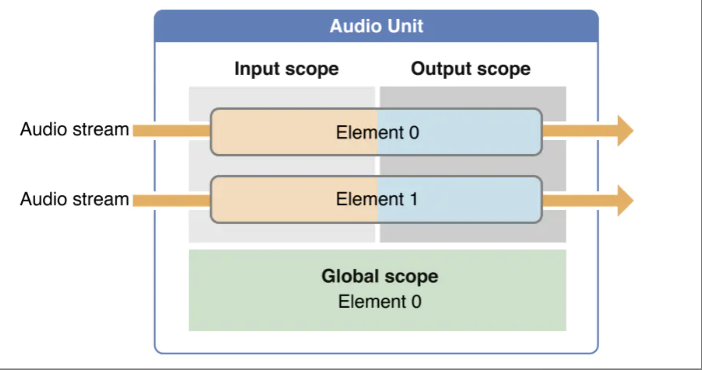

## 官方文档
[The Audio Unit](https://developer.apple.com/library/archive/documentation/MusicAudio/Conceptual/AudioUnitProgrammingGuide/TheAudioUnit/TheAudioUnit.html#//apple_ref/doc/uid/TP40003278-CH12-SW1)
[IO audio unit](https://developer.apple.com/library/archive/documentation/MusicAudio/Conceptual/AudioUnitHostingGuide_iOS/UsingSpecificAudioUnits/UsingSpecificAudioUnits.html#//apple_ref/doc/uid/TP40009492-CH17-SW1)

## 
[iOS Play audio data through Audio Unit](https://www.programmersought.com/article/38823768580/)

好奇怪的文章，图片都是中文的
地下链接了一些文章

## 简书
[简书Audio Unit详解](https://www.jianshu.com/p/8ce865c9bbac)

> audio unit是一个插件
> audio unit可以有多个
> audio unit iOS根据功能提供了七种audio unit，分为四类: effect, mixing, i/o, format conversion
> I/O输出unit，直接连接输出硬件。
> VPIO和RemoteIO是属于IO audio unit提供的一种功能

### 1. 七种四类audio unit
3.1 Effect Unit
iOS4提供了一个effect unit，即iPod Equalizer，与内置iPod应用程序使用的均衡器相同。要查看该audio unit的iPod应用程序用户界面，请转至Setting> iPod> EQ。 使用此audio unit时，您必须提供自己的UI。 该audio unit提供一组预设均衡曲线，如低音增强器，流行音乐和口语

3.2 Mixer Units
iOS提供两个mixer units。3D Mixer unit是OpenAL构建的基础。在大多数情况下，如果需要3D Mixer unit的功能，最佳选择是使用OpenAL，它提供更适合游戏应用的更高级API。

Multichannel Mixer unit可以为任意数量的单声道或立体声流提供混音，并带有立体声输出。你可以打开或关闭每个输入，设置其输入增益，并设置其立体声平移位置。

3.3 I/O Units
iOS提供三个I/O unit。Remote I/O是最常用的。它连接输入和输出音频硬件，并为你提供对各个传入和传出音频样品值的低延迟访问。它提供硬件音频格式和应用程序音频格式之间的格式转换，通过Format Converter unit进行格式转换。

Voice-Processing I/O unit通过添加声学回声消除来扩展远程I/O单元，以用于VoIP或语音聊天应用程序。它还提供自动增益校正，语音处理质量和静音。

Generic Output unit不连接到音频硬件，而是提供将处理链的输出发送到应用程序。通常使用Generic Output unit 进行离线音频处理

3.4 Format Converter Unit
iOS4提供，通常通过I/O单元间接使用


### 2. AudioComponentDescription
要在运行时查找audio unit(找到7种的某一个audio unit)，需要为AudioComponentDescription数据结构指定type，subtype，manufacturer。无论是audio unit还是audio process graph API。
其实就是为了找到哪一种audio unit(比如vpio和remoteio)，先定义AudioComponentDescription 然后通过AudioComponentFindNext找到对应component，最后初始化audiounit
```
AudioComponentDescription audioDesc = {0};
audioDesc.componentType = kAudioUnitType_Output;
audioDesc.componentSubType = kAudioUnitSubType_RemoteIO;
audioDesc.componentManufacturer = kAudioUnitManufacturer_Apple;


// find component
AudioComponent compoent = AudioComponentFindNext(NULL, &audioDesc);
// create new instance
AudioComponentInstanceNew(compoent, &audioUnit);
```

### 3.使用scope和elements来指定audio units的各个部分
Audio unit的各个部分组织成scopes and element，如下图所示。当调用函数去配置和控制audio unit时，你可以指定scope和element以标识函数的特点目标。


scope是audio unit内的编程上下文。虽然global scope可能暗示，但这些上下文从不嵌套。一般是使用一个常量值来自AudioUnitScope枚举。

element是嵌套在audio unit scope中的编程上下文。当element是输入或输出scope的一部分时，它类似于物理音频设备中的信号总线，因此有时成为总线。

global scope适用于整个audio unit，不与任何特定音频流相关联。它只有一个元素，即0。某些属性，如每个切片最大帧数（kAudioUnitProperty_MaximumFramesPerSlice），仅适用于global scope

输入和输出scopes直接参与通过audio unit移动一个或多个音频流。正如你所期待的那样，音频输入scope进入从输出scope离开。属性或参数可以作为整体应用于输入scope或输出scope，某些属性只能应用于scope特定的element

> One input element: element 1. One output element: element 0.
> By default, the input element is disabled and the output element is enabled. If you need to change this, refer to the description of the kAudioOutputUnitProperty_EnableIO property.
> The outward-facing sides of the Remote I/O unit acquire their formats from the audio hardware as follows:
> The input element (element 1) input scope gets its stream format from the currently-active audio input hardware.
> The output element (element 0) output scope gets its stream format from the currently-active output audio hardware.
> Set your application format on the output scope of the input element. The input element performs format conversion between its input and output scopes as needed. Use the hardware sample rate for your application stream format.
> If the input scope of the output element is fed by an audio unit connection, it acquires its stream format from that connection. If, however, it is fed by a render callback function, set your application format on it.


